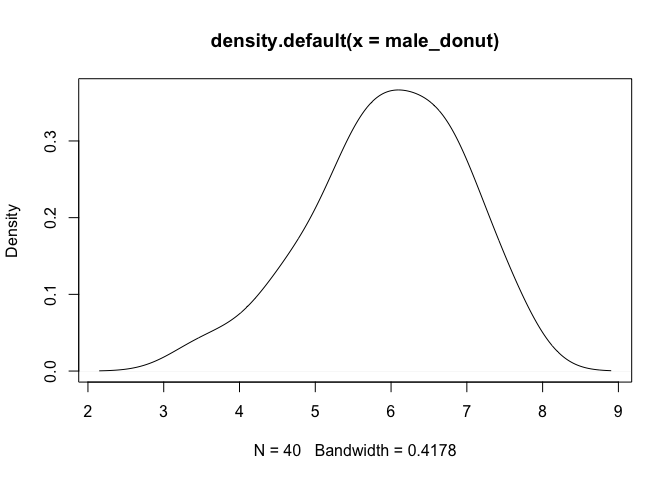
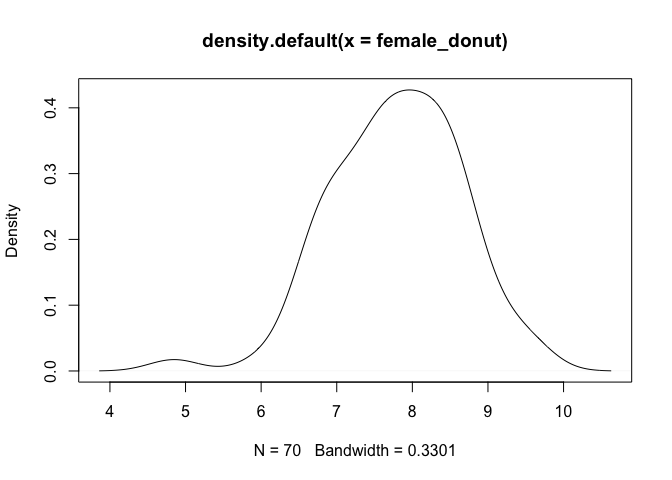

## รู้จักข้อมูล (data)

บทนี้เราจะรู้จักคำว่า ข้อมูล หรือ data กัน ปกติแล้ว
เวลาที่เราสนใจปัจจัยใด ๆ เราจะคาดประมาณค่าที่นักสถิติจะเรียกว่า
Parameter นั่นคือค่าสรุปของกลุ่มประชากรที่เราต้องการจะศึกษา ในขณะที่
Sample (กลุ่มตัวอย่าง) จะหมายถึง กลุ่มตัวอย่างที่เราเลือก (หรือสุ่ม)
มาจากประชากรนั่นเอง การที่เราเข้าใจความแตกต่างของข้อมูลประชากรทั้งหมด
(parameter statistics) กับข้อมูลของกลุ่มตัวอย่าง (sample statistics)
ของเราจะทำให้เราเข้าใจว่าทำไมข้อมูลที่มีข้อมูลตัวอย่างไม่เท่ากับจำนวนประชากร
(ซึ่งเป็นไปได้ยากมากกกกก) สามารถนำมาวิเคราะห์ในทางสถิติได้

### ข้อมูลที่มาจากกลุ่มประชากร

ปกติตัวแปร (variable) ที่เราได้มาจากกลุ่มตัวอย่างโดยเฉพาะตัวแปรตาม
(dependent variable) จะถูกสันนิษฐานว่าจะมีความเป็น Normally Distribution
ในกลุ่มประชากร หมายความว่า ข้อมูลในกลุ่มประชากรจะเป็นลักษณะของระฆังคว่ำ (เสมอในใจของนักสถิติ)

> สมมติว่าเรามีข้อมูลกลุ่มประชากรแมว 50,000 ตัว
> แมวมีค่าเฉลี่ยในการกินอาหารวันละ 4 ครั้ง และมีความคาดเคลื่อนคือ 1

    cat <- rnorm(50000, mean = 4, sd = 1)
    plot(density(cat))

ในกราฟ Density เราจะพบว่ามันมีความเป็น Normally Distributed

สมมติว่าในประชากรสุนัข 100,000 ตัว สุนัขมีค่าเฉลี่ยในการกินอาหารวันละ
2.5 ครั้ง และมีความคาดเคลื่อนในประชากรคือ 1.5

    dog <- rnorm(100000, mean = 2.5, sd = 1.5)
    plot(density(dog))

เราก็จะเห็นได้ว่ากราฟเป็นแบบ Normally distributed เหมือนกัน

ในการ plot กราฟนี้ ความเป็นจริงคือมาจากสมการในการหาค่า z scores
ของข้อมูลในแต่จุดของแกน X (แนวนอน) นั่นเอง

>> **z &lt;- (X -** μ)/σ

ที่นี้!! กราฟที่เป็น Normally distributed นี่แหละ
ที่จะทำให้เราวิเคราะห์เชิงสถิติต่าง ๆ ได้

### ข้อมูลที่มาจากกลุ่มตัวอย่าง (sample statistics)

สมมติว่า
เราต้องการรู้ว่าประชากรผู้หญิงกับผู้ชายกินโดนัทเป็นสัดส่วนเท่าใด
เราอาจจะอ่านงานวิจัยหนึ่งแล้ว นักวิจัยบอกเราว่า

ผู้ชายกินโดนัทเฉลี่ย 6 ครั้งต่อสัปดาห์ ในกลุ่มตัวอย่างชาย 40 คน
ในขณะที่ผู้หญิงกินโดนัทเฉลี่ย 8 ครั้งต่อสัปดาห์ ในกลุ่มตัวอย่างผู้หญิง
70 คน

สิ่งที่จะทำให้เราทราบถึงค่าความคาดเคลื่อนนี้คืออะไรก็คือค่าที่ความคลาดเคลื่อนที่มีอยู่ในกลุ่มตัวอย่างที่เราศึกษานั่นเอง
ซึ่งเราสามารถประมาณค่านี้ได้จากค่าเฉลี่ย (x̄)
ในแต่ละข้อมูลเชิงประจักษ์ของเราและ ความคลาดเคลื่อน (standard error; se)
ของกลุ่มตัวอย่างนั่นเอง

    male_donut <- rnorm(40, mean = 6, sd = 1)
    plot(density(male_donut))

    female_donut <- rnorm(70, mean = 8, sd = 1)
    plot(density(female_donut))

จากกราฟทั้งสองจะพบว่าเป้น normal distributed คล้ายกัน (ให้ sd = 1 จะได้ดูง่าย)

เนื่องจากความสำคัญของการเป็น Normal distribution ของข้อมูล
การวิเคราะห์ทางสถิติหลายวิธียังมีความจำเป็นให้ข้อสันนิฐานนี้ตรงกับใจนักสถิติอยู่
ดังนั้นจึงมีการทดสอบต่าง ๆ ว่าค่าข้อมูลมีแนวโน้มจะออกนอกโค้งนี้ไหม
ซึ่งเราจะเรียนในบทต่อไป เย้!

Note เนื่องจากข้อมูลที่เขียนขึ้นมาใช้หลักการของ normal distribution
อยู่แล้ว ด้วยคำสั่ง rnorm()
ถ้าเราไปเจอข้อมูลเชิงประจักษ์ที่เก็บมาจากกลุ่มตัวอย่างจริง
ค่าความคาดเคลื่อนอาจะมีสูงต่ำแตกต่างไปจากข้อมูลในบทนี้นะ
