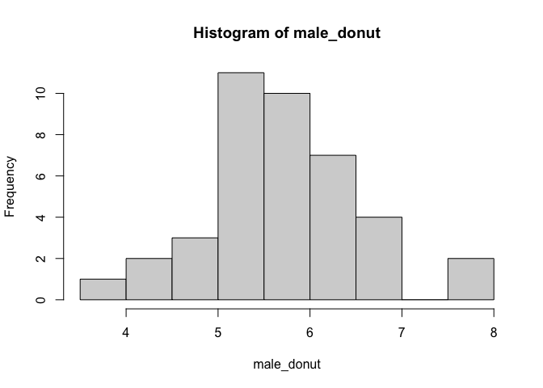

## การทดสอบสมมติฐาน (hypothesis Testing)

จำงานวิจัยที่ผู้ชายและผู้หญิงกินโดนัทได้ไหม?

[โดนัท]()

สมมติว่า

> เราต้องการรู้ว่าประชากรผู้หญิงกับผู้ชายกินโดนัทเป็นสัดส่วนเท่าใด
> เราอาจจะอ่านงานวิจัยหนึ่งแล้ว นักวิจัยบอกเราว่า

> ผู้ชายกินโดนัทเฉลี่ย 6 ครั้งต่อสัปดาห์ ในกลุ่มตัวอย่างชาย 40 คน
> ในขณะที่ผู้หญิงกินโดนัทเฉลี่ย 8 ครั้งต่อสัปดาห์ ในกลุ่มตัวอย่างผู้หญิง
> 70 คน

  
มองคร่าวๆ เราอาจสรุปไม่ได้ว่าค่าเฉลี่ย 6 ครั้งของผู้ชาย และ 7 ครั้งของผู้หญิงต่างไหม
แล้วมีวิธีใดบ้างที่ทำให้เรารู้ว่ามันต่างกันไหม

    a : ต่างสิ แค่เห็น 6 กับ 7 ก็ต่างกันละ
    b : แต่แกต้องดูว่าเก็บมาจากกลุ่มตัวอย่างกี่คนด้วย ชาย 40 หญิง 70 เอามาเทียบกันได้ไง
    c : แล้วความแตกต่างของแต่ละคนจะเอาค่าเฉลี่ยเทียบเลยไม่ได้นะ

### Hypothesis Testing

จากบทก่อนหน้านี้
เราอาจจะเริ่มเรียนรู้ว่าข้อมูลในโลกความจริงโดยเฉพาะที่มาจากกลุ่มตัวอย่างมีความกำกวมสูง
นักสถิติจึงคิดค้นวิธีการคำนวณการเปรียบเทียบหรือความสัมพันธ์ของข้อมูลที่เก็บมา

คำถามคือ “ทำอย่างไรให้ข้อมูลที่เก็บมาสะท้อนถึงข้อมูลของประชากรจริงๆ มากที่สุด?”

ในทางวิจัยมีวิธีการเก็บข้อมูลที่จะช่วยให้ได้กลุ่มตัวอย่างที่สะท้อนถึงประชากรในขณะเดียวกัน ในเชิงสถิติ ข้อมูลที่เก็บมาจากกลุ่มตัวอย่างจะถูกเรียกว่าโค้งกลุ่มตัวอย่าง หรือ sampling distribution

    set.seed(1990)
    male_donut <- rnorm(40, mean = 6, sd = 1)
    hist(male_donut)

    female_donut <- rnorm(70, mean = 8, sd = 1)
    hist(female_donut)

    Gender <- c(rep("male", 40), c(rep("female", 70)))
    male_donut <- as.data.frame(male_donut)
    female_donut <- as.data.frame(female_donut)
    colnames(female_donut) <- "donut"
    colnames(male_donut) <- "donut"
    donut <- rbind(male_donut, female_donut)
    data_donut <- cbind(Gender, donut)

    #Plot
    library(ggplot2)
    ggplot(data_donut) + geom_density(aes(x=donut, fill=Gender), alpha=.5)

เมื่อนำกราฟมาเปรียบเทียบกันระหว่างชายและหญิง
จะพบว่ามีพื้นที่ที่ซ้อนทับกันอยู่

ถ้าเราทำการวิจัยอยู่บนข้อมูลนี้ เราจะต้องตั้งคำถามการวิจัยขึ้นมาก่อน

       a : ผู้หญิงกินโดนัทมากกว่าผู้ชายชัวร์
       b : ฉันเห็นผู้ชายชอบกินของหวานออก
       c : เราว่ามันน่าจะพอ ๆ กันแหละ

แล้วเราควรจะตั้งคำถามงานวิจัยว่าอย่างไร?

### การตั้งคำถามงานวิจัย

Research hypothesis หรือ คำถามในการวิจัย จะเป็นธงให้เราทดสอบ ตั้งคำถามสถิติ รวมไปถึงการสรุปงานวิจัย

ในกรณีการกินโดนัท สมมติว่า คำถามของงานวิจัยเราคือ

> ผู้หญิงกินโดนัทเฉลี่ยต่อสัปดาห์มากกว่าผู้ชาย

เราจะได้คำถามเชิงสถิติขึ้นมา เรียกว่า สมมติฐานว่าง หรือ (null hypothesis; H0) จะสันนิษฐานเสมอว่ากลุ่มตัวอย่าง (ไม่ว่าจะกี่กลุ่ม) มีค่าเฉลี่ยเท่ากัน คือ

     x̄ การกินโดนัทต่อสัปดาห์ของผู้ชาย !=  x̄ การกินโดนัทต่อสัปดาห์ของผู้หญิง

ในขณะที่สมมติฐานทางเลือก (alternative hypothesis; H1) จะสันนิษฐานว่ามีค่าเฉลี่ยกลุ่มใดกลุ่มหนึ่งมีค่ามากกว่า/น้อยกว่า กันอย่างมีนัยสำคัญทางสถิติ

> นัยสำคัญทางสถิติ (BRB)

> ในส่วนของการทดสอบสมมติฐาน เราจะทดสอบสมมติฐานว่าง (H0) โดยคิดว่ามันเป็นจริง จากนั้นเราจะไปเก็บข้อมูล 
> และ มีข้อสรุปว่าเราจะ *“ปฎิเสธสมมติฐานว่างว่าเป็นจริง”* หรือ *“คงไว้ซึ่งสมมติฐานว่าง”*
> (Howell, 2017)

ว่าแต่ สรุปใครกินโดนัทมากกว่ากัน? &gt;o&lt;
